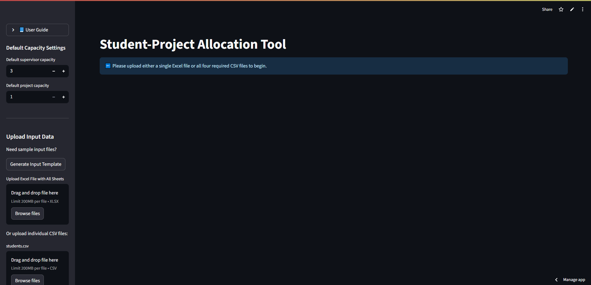

# Student Allocation System

A web application for automatically allocating students to final-year projects using different matching algorithms. The system replaces manual spreadsheet-based allocation and allows comparison of algorithm performance to improve fairness and satisfaction.

---

## Overview

Universities often allocate students to final-year projects based on preferences submitted by students and supervisors. This process is frequently managed manually using spreadsheets, which can be time-consuming and difficult to optimise.

This project implements a web-based allocation tool that allows users to upload preference data, run different allocation algorithms, and analyse the resulting outcomes through interactive visualisations.

The system was developed as part of my **MSc Advanced Computer Science dissertation**.

---

## Features

- Upload student and project preference data from Excel files
- Run multiple allocation algorithms
- Compare allocation outcomes across different methods
- Interactive visualisation of results
- Automatic validation of uploaded data
- Export results back to Excel for further analysis

---

## Allocation Algorithms Implemented

The system compares three different approaches to the allocation problem:

### Greedy Algorithm
Assigns students sequentially to their highest available preference.

### Stable Marriage Algorithm
Uses a matching algorithm to create stable student-project pairings based on preference rankings.

### Linear Programming Optimisation
Uses mathematical optimisation to maximise overall satisfaction across all allocations.

These approaches allow the user to compare fairness, satisfaction, and allocation efficiency.

---

## Technologies Used

### Language
- Python

### Libraries
- Streamlit (web interface)
- Pandas (data processing)
- Matplotlib (visualisation)
- OpenPyXL (Excel file handling)

### Tools
- Git
- GitHub

---

## Example Workflow

1. Upload Excel files containing student preferences and project data.
2. Validate the input data to ensure formatting and constraints are correct.
3. Select and run one of the allocation algorithms.
4. View allocation results through summary tables and visualisations.
5. Export the allocation results as an Excel file.

---

## Screenshots

### Application Interface

